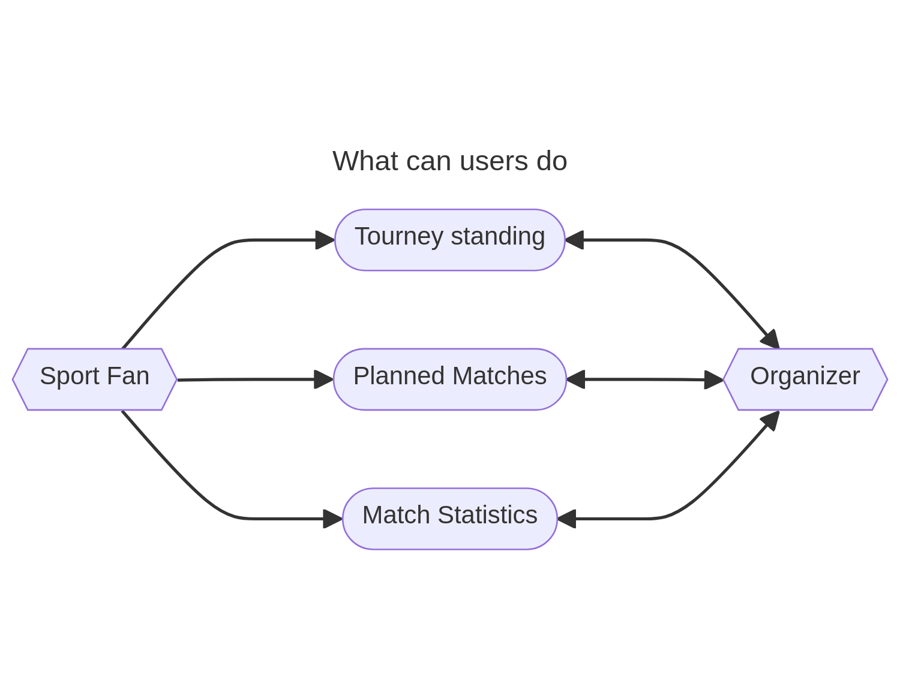

# Mobile-App

## Todo App: Ambella Francis Personal Assignment

Hello Sir, I put the work of the student **Ambella Francis** in the folder bellow
[ToDo App Source](./ambella_francis/)

## Intro

This is the work of **Group 5 (Online Student)** for **Intro Mobile Application Development (SE 3140)** throughout *Fall 23*

## Presentation

Here are the talking points expected by the prof :

- MVC model relationship with the project
- Presentation of the Android app view

## Application Overview

The project is using **React Native**. The MVP will implement the view above first

## Work Distribution

So here is the role :

- [ ] Godwill ----> Tournament Standing View
- [ ] Lennon ----> Match Statistics View
- [ ] Steve    ----> Planned Matches View
- [ ] Nixon & Philomene ----> Tournament Creation
- [ ] Tiyo & Segolene      ----> Match scheduling Creation

